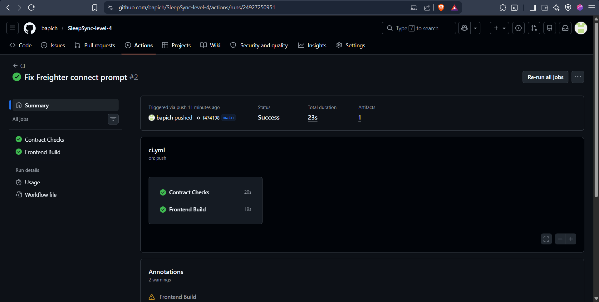

# SleepSync

<div align="center">

**A Decentralized Sleep Tracking Platform for Building Accountable Rest Habits**

*Trustless sleep discipline tracking secured by Stellar Soroban smart contracts*

[](https://sleepsync-stellar.netlify.app)
[](https://github.com/bapichandra/Sleepsync)
[](https://stellar.expert/explorer/testnet)
[](https://www.risein.com/)
[](https://github.com/bapichandra/Sleepsync/actions/workflows/ci.yml)

</div>

---

## Table of Contents

1. [Problem Statement](#problem-statement)
2. [Why Stellar?](#why-stellar)
3. [Live Deployment](#live-deployment)
4. [Contract Addresses & Transactions](#contract-addresses--transactions)
5. [Architecture & ICC Flow](#architecture--icc-flow)
6. [Smart Contracts](#smart-contracts)
7. [Production Features & Hardening](#production-features--hardening)
8. [Submission Screenshots](#submission-screenshots)
9. [Tech Stack](#tech-stack)
10. [Project Structure](#project-structure)
11. [Testing](#testing)
12. [CI/CD Pipeline](#cicd-pipeline)
13. [Local Development](#local-development)
14. [Roadmap](#roadmap)
15. [Author](#author)

---

## Problem Statement

Modern hustle culture promotes sleep deprivation, leading to burnout, decreased productivity, and severe health issues. Traditional sleep trackers are passive — they collect data but provide no accountability or verifiable proof of consistency.

| Issue | Impact |
|-------|--------|
| **Passive Tracking** | Web2 apps track sleep but fail to incentivize consistency |
| **Data Privacy** | Centralized trackers harvest and monetize personal health data |
| **Lack of Accountability** | No verifiable milestones or tangible rewards for hitting sleep goals |
| **Opaque Metrics** | Recovery algorithms are hidden and cannot be audited |

**SleepSync** solves this by enforcing accountable sleep discipline using programmable, auditable Soroban smart contracts. Users set on-chain rest goals, log their sleep sessions, and receive verifiable recovery scores and token rewards for consistency — completely transparent and decentralized.

---

## Why Stellar?

SleepSync requires a fast, low-cost network to function as a daily tracker:

| Stellar Property | SleepSync Benefit |
|-----------------|-------------------|
| **~5 second finality** | Sleep logs and profile updates reflect instantly on the dashboard |
| **Sub-cent fees** | Economically viable for daily active logging (unlike Ethereum) |
| **Soroban Inter-Contract Calls** | The SleepSync contract atomically commands the Reward contract to mint SLEEP tokens |
| **Immutable State** | Sleep streaks and recovery scores cannot be manipulated off-chain |

---

## Live Deployment

| Resource | Link |
|----------|------|
| **Live dApp** | [sleepsync-stellar.netlify.app](https://sleepsync-stellar.netlify.app) |
| **GitHub Repo** | [bapichandra/Sleepsync](https://github.com/bapichandra/Sleepsync) |

---

## Contract Addresses & Transactions

All contracts are deployed on the **Stellar Testnet**.

### Deployed Contract IDs

| Contract | Address |
|----------|---------|
| **SleepSync Contract** | `CCD376AONWVQF2EPK6BMLS3PDBMIWVWHV4DIAZVIDJZEUOK6HPYAE2EH` |
| **Reward Token Contract** | `CBSBELINRPBBQPT6HIOADU5HA2NUSWXTAA5A7AJQ2ZPSYWMHZXGJ5JFR` |

### On-Chain Deployment Transactions

| Action | Transaction Hash |
|--------|-----------------|
| **SleepSync WASM Upload** | [`6c67f75c...0b76`](https://stellar.expert/explorer/testnet/tx/6c67f75c68a02a5d90c0e1d9c78ebcdfcc7d817568b5a89b9a82c1ad64c00b76) |
| **SleepSync Deploy** | [`42a7bd0f...dc5d`](https://stellar.expert/explorer/testnet/tx/42a7bd0f7ef1c1eaae3e64f03200e5c5ee0af8fe0133d6ade8d4d1f0716edc5d) |

---

## Architecture & ICC Flow

SleepSync is composed of a Soroban smart contract for tracking, a Reward Token contract for incentives, and a React/Vite frontend that builds and submits signed Stellar transactions.

```text
┌─────────────────────────────────────────────────────────────────────┐
│                        React/Vite Frontend                          │
│                                                                     │
│  Landing  |  Dashboard  |  Log Sleep  |  Settings  |  Leaderboard   │
│                           Freighter API                             │
└──────────────────┬─────────────────────────────┬────────────────────┘
                   │ TypeScript Contract Clients │
          ┌────────▼─────────┐         ┌─────────▼────────┐
          │ SleepSync Tracker│──ICC──→ │   Reward Token   │
          │                  │         │                  │
          │  save_profile()  │         │  initialize()    │
          │  log_session()   │         │  mint()          │
          │  update_goal()   │         │  balance()       │
          │  get_dashboard() │         │                  │
          └──────────────────┘         └──────────────────┘
                             Stellar Testnet
```

### Inter-Contract Communication (ICC) Flow

When a user successfully reaches their weekly sleep goal, the SleepSync contract automatically instructs the Reward contract to mint tokens to their address.

```text
Step 1: User calls save_profile()  -> Sets weekly goal (e.g. 2400 mins)
Step 2: User calls log_session()   -> Adds minutes to current week
Step 3: Contract evaluates logic   -> If minutes_this_week >= weekly_goal_minutes
Step 4: SleepSync ICCs Token       -> token_client.mint(user, 100)
```

---

## Smart Contracts

### SleepSync Contract (`CCD376AONWVQF2EPK6BMLS3PDBMIWVWHV4DIAZVIDJZEUOK6HPYAE2EH`)

Manages sleep profiles, tracking logs, and recovery metrics.

| Function | Access | Description |
|----------|--------|-------------|
| `save_profile()` | User | Creates or updates a sleep profile with a weekly goal |
| `update_weekly_goal()`| User | Adjusts the target rest minutes for the current week |
| `log_session()` | User | Logs sleep duration, sleep type, and bedtime punctuality |
| `get_dashboard()` | Public (read) | Queries aggregated stats (streak, consistency, recovery) |
| `has_profile()` | Public (read) | Checks if an address has initialized a profile |

---

## Production Features & Hardening

### Smart Contract Security & Validation
- **Strict Input Validation**: Display names (3-32 chars), sleep duration (5-480 mins), goals (30-5000 mins).
- **Stale State Prevention**: Automatic week syncing prevents outdated data from carrying over.
- **Profile Guards**: Checks prevent uninitialized users from executing `log_session`.

### Frontend Production Quality
- **Simulation Error Handling**: Intercepts simulation errors with user-friendly UI guidance.
- **React Error Boundaries**: Catches component errors and presents recovery options.
- **SPA Routing**: Production rewrite rules ensure routing works cleanly across all views.
- **Responsive Layout**: Designed for mobile and desktop viewports.

---

## Submission Screenshots

### Deployed Dashboard

<p align="center">
  
</p>

### Settings & Profile

<p align="center">
  
</p>

### Mobile Responsive UI

<p align="center">
  
</p>

### CI/CD Pipeline

<p align="center">
  
</p>

---

## Testing

### Contract Unit Tests (Rust)

```bash
cargo test
```

**Test Results Summary:**
- `sleep_sync`: 10 passed, 0 failed
- `sleep_reward`: 4 passed, 0 failed
- **Total**: 14 tests passing cleanly.

---

## Tech Stack

| Layer | Technology | Purpose |
|-------|-----------|---------|
| **Frontend Framework** | React / Vite | Fast, responsive single page application |
| **Styling** | Vanilla CSS / CSS Modules | Custom responsive design system |
| **Smart Contracts** | Soroban (Rust) | On-chain sleep tracking & token minting |
| **Blockchain SDK** | @stellar/stellar-sdk | Transaction building, XDR encoding, RPC calls |
| **Wallet Integration** | @creit.tech/stellar-wallets-kit / Freighter | Wallet connection and transaction signing |
| **CI/CD** | GitHub Actions | Automated build and test pipeline |
| **Hosting** | Netlify | Frontend production deployment |

---

## Project Structure

```text
SleepSync/
├── .github/
│   └── workflows/
│       └── ci.yml                    # Automated build and test pipeline
├── frontend/                         # Vite React dApp
│   ├── src/
│   │   ├── components/               # Navbar, Loading States, Leaderboard
│   │   ├── pages/                    # Dashboard, Log, Settings, Activity
│   │   ├── lib/
│   │   │   └── sleepSync.js          # Soroban SDK integration wrapper
│   │   └── App.jsx                   # Router and state management
│   └── netlify.toml                  # Netlify deployment configuration
├── contracts/
│   ├── sleep_sync/                   # Core tracker smart contract
│   └── sleep_reward/                 # Reward token smart contract
├── scripts/                          # Deployment and config export scripts
├── deployments/testnet.json          # Stellar Testnet deployment record
└── sub assets/                       # Submission screenshots
```

---

## CI/CD Pipeline

Triggered automatically on every push and pull request to `main`.

```text
Push to main
     |
     ├── Install Dependencies (Rust + Node)
     ├── Run Smart Contract Tests (cargo test)
     ├── Compile WASM Binaries (cargo build)
     └── Build Web App (npm run build:web)
```

---

## Local Development

### Prerequisites
- **Node.js** 20+
- **Rust** (stable toolchain)
- **Stellar CLI**

### Installation

```bash
# Clone the repository
git clone https://github.com/bapich/Sleepsync.git
cd Sleepsync

# Install dependencies
npm install
```

```bash
# Start development server
npm run dev
```

### Full Verification Pipeline

```bash
# Run all contract tests and build production Web App
npm run verify
```

---

## Roadmap

### Level 3 - Orange Belt (Completed)
- Soroban smart contracts (`sleep_sync` and `sleep_reward`) with Inter-Contract Calls (ICC).
- On-chain goal tracking, sleep session logging, streak calculation, and reward minting.
- React/Vite dApp with Freighter & Stellar Wallets Kit support.
- Fully automated CI/CD pipeline and Netlify production deployment.

---

## Author

**Bapi Chandra**
