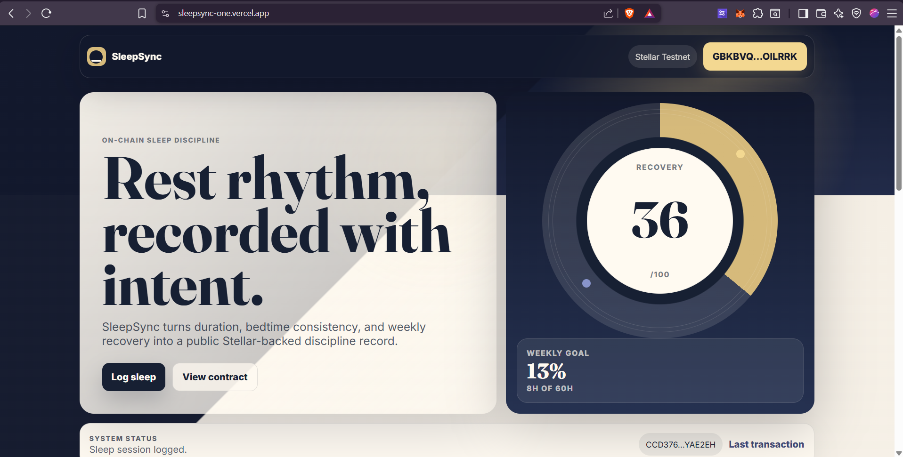
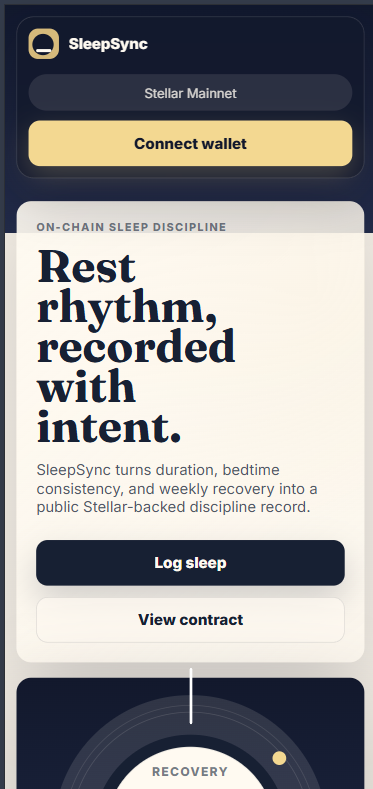

# SleepSync

[](https://github.com/bapich/level-4-Sleepsync/actions/workflows/ci.yml)

SleepSync is a production-ready Stellar Soroban dApp for building accountable sleep discipline. It lets a user connect a Freighter wallet, create an on-chain sleep profile, set a weekly rest goal, log sleep sessions, and review recovery metrics generated from contract state.

- Live demo: https://sleepsync-level-4.vercel.app
- GitHub repository: https://github.com/bapich/level-4-Sleepsync
- MVP video: https://drive.google.com/file/d/18eCFxW8KkVGKhuTWgdlSQWu2hJvEFe0-/view?usp=sharing
- Network: Stellar Testnet
- Contract ID: `CCD376AONWVQF2EPK6BMLS3PDBMIWVWHV4DIAZVIDJZEUOK6HPYAE2EH`
- Frontend: React, Vite, Stellar SDK, Freighter
- Smart contract: Rust, Soroban SDK

## Overview

SleepSync focuses on consistency rather than passive tracking. The contract stores each wallet's profile, weekly sleep target, total rest minutes, current week progress, bedtime streak, consistency score, recovery score, and session history. The frontend presents those actions through a responsive dashboard with wallet signing, live Soroban reads, contract event summaries, and explorer links.

Core flow:

1. Connect a Freighter wallet on Stellar Testnet.
2. Create or update a SleepSync profile.
3. Set a weekly sleep-minute goal.
4. Log sleep sessions with duration, sleep type, and bedtime status.
5. Track weekly progress, streak, consistency, recovery, and recent on-chain activity.

## Screenshots

### Deployed Dashboard



### Mobile Responsive View



### CI/CD Pipeline


## Deployment

### Frontend

- Provider: Vercel
- Project name: `sleepsync-level-4`
- Production URL: https://sleepsync-level-4.vercel.app
- Build command: `npm run build:web`
- Output directory: `frontend/dist`

### Smart Contract

- Contract name: `SleepSync`
- Contract alias: `sleep_sync`
- Network: Stellar Testnet
- Source account alias: `alice`
- Deployed at: `2026-04-25T08:39:17.430Z`
- Contract ID: `CCD376AONWVQF2EPK6BMLS3PDBMIWVWHV4DIAZVIDJZEUOK6HPYAE2EH`
- Contract explorer: https://lab.stellar.org/r/testnet/contract/CCD376AONWVQF2EPK6BMLS3PDBMIWVWHV4DIAZVIDJZEUOK6HPYAE2EH
- WASM upload transaction hash: `6c67f75c68a02a5d90c0e1d9c78ebcdfcc7d817568b5a89b9a82c1ad64c00b76`
- Contract deploy transaction hash: `42a7bd0f7ef1c1eaae3e64f03200e5c5ee0af8fe0133d6ade8d4d1f0716edc5d`

The deployment record is stored in [`deployments/testnet.json`](./deployments/testnet.json), and the frontend fallback contract config is generated into [`frontend/src/lib/contract-config.js`](./frontend/src/lib/contract-config.js).

## Contract Implementation

SleepSync is implemented as an advanced Soroban contract with profile management, session persistence, weekly goal tracking, streak calculation, recovery scoring, consistency scoring, validation guards, and contract events.

Public methods:

- `save_profile(sleeper, display_name, weekly_goal_minutes)`
- `update_weekly_goal(sleeper, new_goal_minutes)`
- `log_session(sleeper, sleep_type, minutes_slept, slept_on_time)`
- `has_profile(sleeper)`
- `get_dashboard(sleeper)`
- `get_session_count(sleeper)`
- `get_session(sleeper, index)`

Events:

- `profile_saved`
- `weekly_goal_updated`
- `sleep_logged`
- `weekly_goal_reached`

Validation:

- Display names: 3-32 characters
- Sleep labels: 3-48 characters
- Session duration: 5-480 minutes
- Weekly goals: 30-5000 minutes

## Requirements Status

| Requirement | Status |
| --- | --- |
| Public GitHub repository | Complete |
| README with complete documentation | Complete |
| Live deployed demo | Complete: https://sleepsync-level-4.vercel.app |
| CI/CD running | Complete: GitHub Actions badge and screenshot included |
| Mobile responsive | Complete: screenshot included |
| Minimum 8+ meaningful commits | Complete |
| Production-ready advanced contract implementation | Complete |
| Inter-contract call working | Not applicable: SleepSync does not require inter-contract calls |
| Custom token or pool deployed | Not applicable: no custom token or pool is used |

## Submission Checklist

- Public GitHub repository: https://github.com/bapich/level-4-Sleepsync
- Live demo link: https://sleepsync-level-4.vercel.app
- MVP video: https://drive.google.com/file/d/18eCFxW8KkVGKhuTWgdlSQWu2hJvEFe0-/view?usp=sharing
- Mobile responsive screenshot: [`assets/02-mobile-responsive.png`](./assets/02-mobile-responsive.png)
- CI/CD screenshot: [`assets/03-cicd-pipeline.png`](./assets/03-cicd-pipeline.png)
- CI/CD badge: included at the top of this README
- Contract address: `CCD376AONWVQF2EPK6BMLS3PDBMIWVWHV4DIAZVIDJZEUOK6HPYAE2EH`
- WASM upload transaction: `6c67f75c68a02a5d90c0e1d9c78ebcdfcc7d817568b5a89b9a82c1ad64c00b76`
- Contract deploy transaction: `42a7bd0f7ef1c1eaae3e64f03200e5c5ee0af8fe0133d6ade8d4d1f0716edc5d`
- Inter-contract calls: not used
- Token or pool address: not applicable

## Repository Structure

```text
SleepSync-level-4/
|-- contracts/sleep_sync/        # Rust Soroban smart contract
|-- frontend/                    # Vite React dApp
|-- scripts/                     # Deployment and config export scripts
|-- deployments/testnet.json     # Stellar Testnet deployment record
|-- assets/                      # Submission screenshots
|-- .github/workflows/ci.yml     # GitHub Actions pipeline
`-- vercel.json                  # Vercel build configuration
```

## Local Development

```bash
npm install
npm run dev
```

Contract tests:

```bash
npm run contract:test
```

Frontend build:

```bash
npm run build:web
```

Full verification:

```bash
npm run verify
```

## Deployment Workflow

Create and fund a Stellar Testnet identity:

```bash
stellar keys generate alice --network testnet --fund
```

Configure environment variables:

```bash
STELLAR_ACCOUNT=alice
STELLAR_NETWORK=testnet
STELLAR_CONTRACT_ALIAS=sleep_sync
VITE_STELLAR_RPC_URL=https://soroban-testnet.stellar.org
VITE_STELLAR_NETWORK_PASSPHRASE="Test SDF Network ; September 2015"
VITE_CONTRACT_ID=
```

Build, deploy, export frontend config, and build the web app:

```bash
npm run contract:build
npm run contract:deploy
npm run export:frontend
npm run build:web
```
